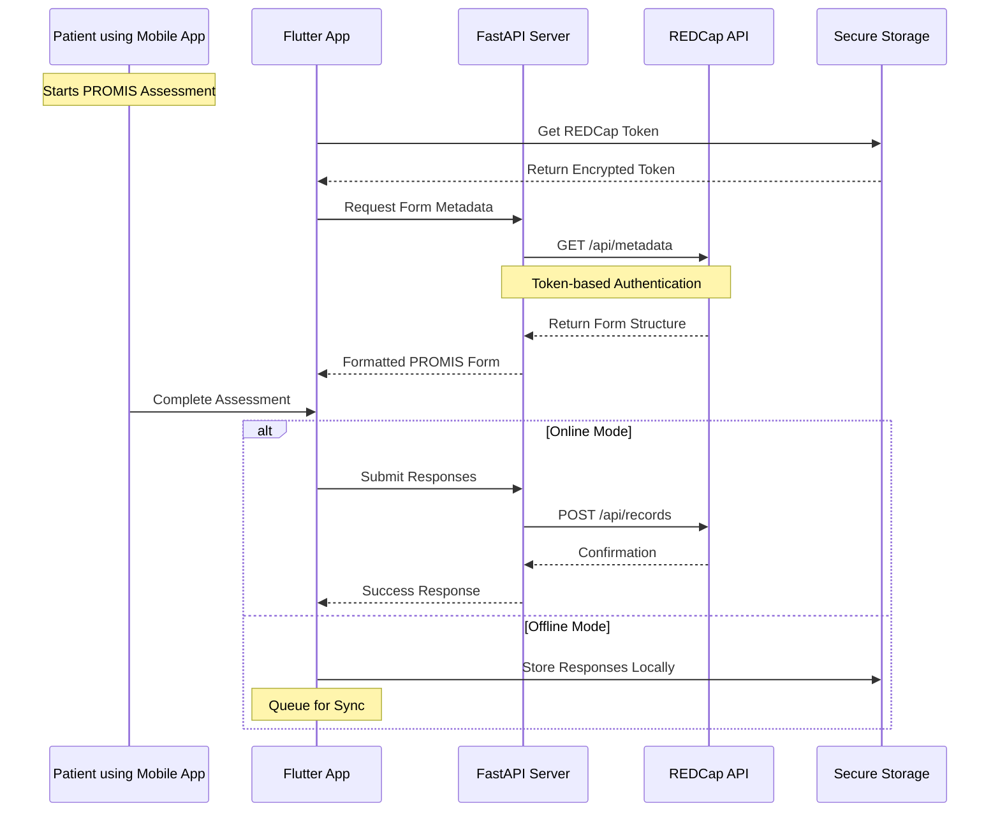

# CarePal: HL7 FHIR based AI Assistant for Liver Cirrhosis Management

## REDCap Integration

### Data Flow Architecture

```mermaid
sequenceDiagram
    participant Patient using Mobile App
    participant Flutter App
    participant FastAPI Server
    participant REDCap API
    participant Secure Storage

    Note over Patient using Mobile App: Starts PROMIS Assessment
    
    Flutter App->>Secure Storage: Get REDCap Token
    Secure Storage-->>Flutter App: Return Encrypted Token
    
    Flutter App->>FastAPI Server: Request Form Metadata
    FastAPI Server->>REDCap API: GET /api/metadata
    Note over FastAPI Server,REDCap API: Token-based Authentication
    REDCap API-->>FastAPI Server: Return Form Structure
    FastAPI Server-->>Flutter App: Formatted PROMIS Form
    
    Patient using Mobile App->>Flutter App: Complete Assessment
    
    alt Online Mode
        Flutter App->>FastAPI Server: Submit Responses
        FastAPI Server->>REDCap API: POST /api/records
        REDCap API-->>FastAPI Server: Confirmation
        FastAPI Server-->>Flutter App: Success Response
    else Offline Mode
        Flutter App->>Secure Storage: Store Responses Locally
        Note over Flutter App: Queue for Sync
    end
```